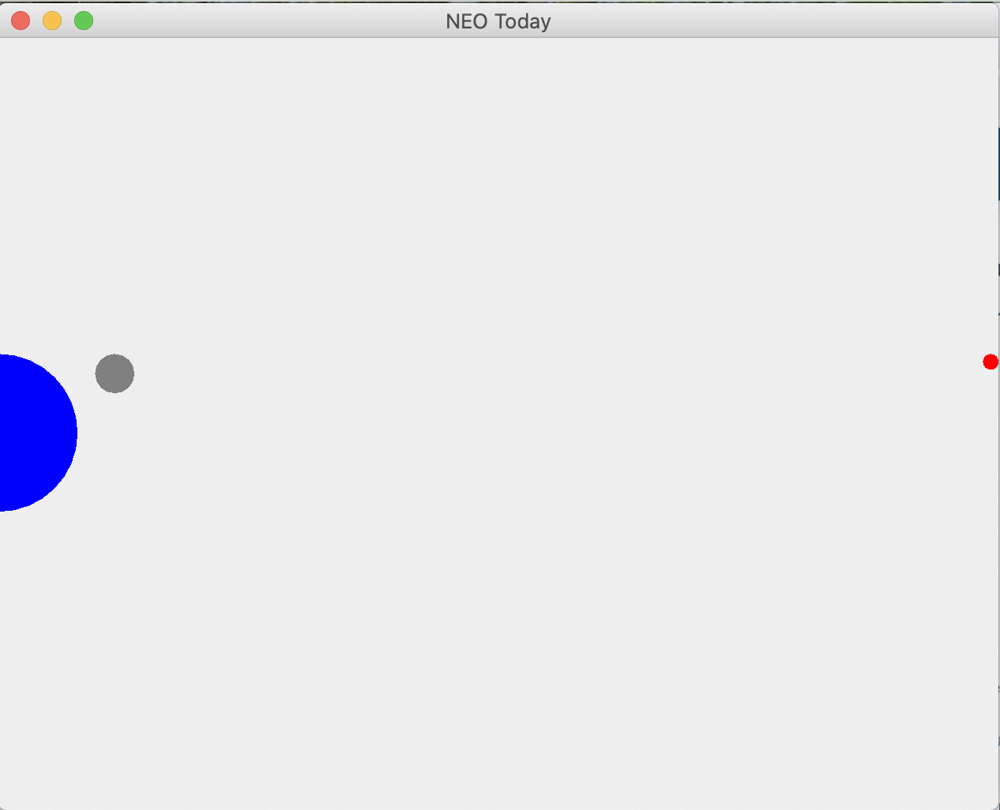

#NASA NEO API Display

This is a test application I wrote in MCO-152 to learn:
* APIs
* JSON
* Retrofit
* Guice
* Gson
* Gradle
* Mockito
* Model-View-Controller
* Factory pattern
* Executable jar file
* Markdown

This displays the [Near Earth Object](https://api.nasa.gov/) data from NASA.

